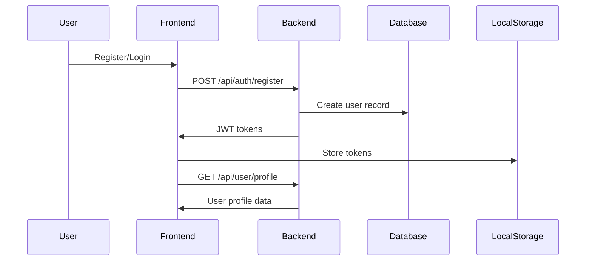
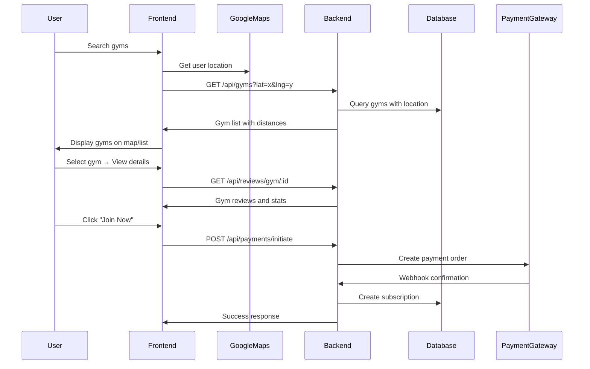
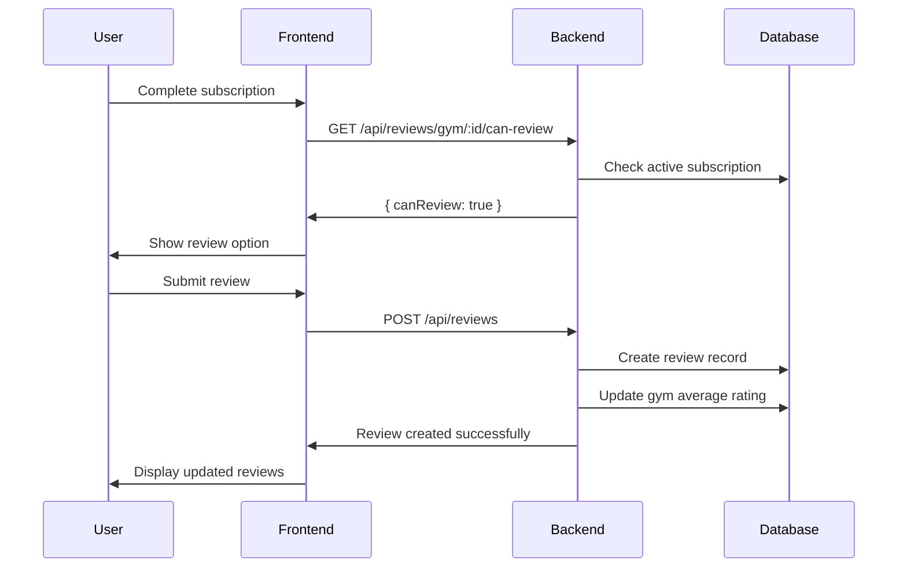

# 🏗️ GYM PWA System Architecture

## 📊 **Complete System Overview**

This document provides a comprehensive overview of the GYM PWA system architecture, covering both frontend and backend components with their integration points.

---

## 🎯 **Technology Stack**

### **Frontend (React PWA)**
- **Framework**: React 18 + TypeScript
- **State Management**: Zustand stores
- **UI Components**: Tailwind CSS + Lucide Icons
- **Maps Integration**: Google Maps API
- **Payment UI**: Custom payment gateway modals
- **PWA Features**: Service Worker, Offline support

### **Backend (Node.js API)**
- **Runtime**: Node.js + Express.js
- **Database**: MySQL + Sequelize ORM
- **Authentication**: JWT with refresh tokens
- **Payment Gateways**: Razorpay + PhonePe
- **File Upload**: Multer
- **Documentation**: Swagger UI
- **Security**: Helmet, CORS, Rate limiting

---

## 📱 **Frontend Architecture**

### **Component Structure**
```
src/
├── components/
│   ├── features/          # Main feature components
│   │   ├── GymDiscovery   # Gym search and discovery
│   │   ├── MySubscriptions # User subscription management
│   │   └── ProfileSettings # User profile management
│   ├── gym/               # Gym-specific components
│   │   └── GymDetails     # Detailed gym view with reviews
│   ├── ui/                # Reusable UI components
│   │   ├── GymImageCarousel
│   │   ├── SubscriptionPurchaseModal
│   │   └── PaymentGatewayModal
│   └── common/            # Common components
│       └── GymDiscoveryMap # Interactive map component
├── services/              # API service layer
│   ├── gymService         # Gym data operations
│   ├── paymentService     # Payment processing
│   ├── subscriptionService # Subscription management
│   └── reviewService      # Review system operations
├── stores/                # State management
│   ├── gymStore          # Gym data state
│   ├── authStore         # Authentication state
│   └── userStore         # User data state
└── utils/                 # Utility functions
    ├── timeFormat        # Time formatting utilities
    └── validation        # Form validation helpers
```

### **Key Frontend Features**

#### **1. Gym Discovery System**
- **Location-based search** with GPS integration
- **Interactive map view** with gym markers
- **Advanced filtering** (distance, rating, amenities)
- **Real-time distance calculations**
- **Responsive grid/list views**

#### **2. Direct Payment Flow**
```javascript
// Payment flow integration
const handleDirectPayment = async (gym, plan) => {
  // 1. Close gym details modal
  setShowDetailedView(false);
  
  // 2. Validate user authentication
  if (!user) {
    showError('Please login to purchase');
    return;
  }
  
  // 3. Check for active subscriptions
  const hasActive = await checkActiveSubscriptions();
  if (hasActive) {
    showError('You already have an active subscription');
    return;
  }
  
  // 4. Map plan period to subscription
  const subscription = findSubscriptionByPeriod(gym, plan.period);
  
  // 5. Open payment modal directly
  setSelectedPlan({
    subscriptionId: subscription.id,
    planType: getPlanType(plan.period),
    amount: plan.price,
    gymName: gym.name
  });
  setShowPaymentModal(true);
};
```

#### **3. Review System Integration**
- **Review display** in gym details
- **Star rating components**
- **Review creation flow** post-subscription
- **Review pagination** and filtering
- **User review management**

---

## 🔧 **Backend Architecture**

### **Database Schema (MySQL + Sequelize)**

#### **Core Models**
```javascript
// User Management
├── User (email PK, roles: user/owner/admin)
├── RefreshToken (JWT refresh token storage)
├── UserProfile (extended profile data)
├── ProfileImage (user profile pictures)

// Gym Management  
├── Gym (location, ratings, operating hours)
├── GymImage (multiple gym photos)
├── Amenity (gym facilities)

// Subscription System
├── Subscription (pricing plans, validity)
├── SubscriptionFeature (plan features)
├── UserSubscription (active memberships)

// Payment System
├── Payment (multi-gateway support)
├── VendorPaymentConfig (payment gateway configs)
├── Invoice (automated invoice generation)
├── Refund (payment reversal system)

// Slot Booking System
├── GymSlot (time-based gym slots)
├── SlotAvailability (slot capacity tracking)
├── UserSlotBooking (user bookings)
├── SlotWaitlist (waiting list system)

// Review System (NEW)
├── Review (user reviews and ratings)

// Advertisement System
├── Advertisement (promotional content)
├── AdvertisementAnalytics (performance tracking)
```

#### **Key Relationships**
```javascript
// User → Multiple Reviews → Single Gym
User.hasMany(Review, { foreignKey: 'userEmail' });
Review.belongsTo(User, { foreignKey: 'userEmail' });
Gym.hasMany(Review, { foreignKey: 'gymId' });
Review.belongsTo(Gym, { foreignKey: 'gymId' });

// Subscription eligibility for reviews
// Only users with active subscriptions can review gyms
```

### **API Architecture**

#### **Authentication Layer**
```javascript
// JWT-based authentication with refresh tokens
POST /api/auth/login     // User login
POST /api/auth/register  // User registration
POST /api/auth/refresh   // Token refresh
POST /api/auth/logout    // Secure logout
```

#### **Review System APIs (NEW)**
```javascript
// Review Management
POST   /api/reviews                    // Create review (requires active subscription)
GET    /api/reviews/gym/:gymId         // Get gym reviews (public)
GET    /api/reviews/user               // Get user's reviews (protected)
GET    /api/reviews/gym/:gymId/stats   // Get rating statistics (public)
GET    /api/reviews/gym/:gymId/can-review // Check review eligibility (protected)
PUT    /api/reviews/:reviewId          // Update review (owner only)
DELETE /api/reviews/:reviewId          // Delete review (owner only)
```

#### **Gym Management APIs**
```javascript
GET    /api/gyms                 // Search gyms with filters
GET    /api/gyms/:id            // Get gym details
POST   /api/gyms               // Create gym (owner/admin)
PUT    /api/gyms/:id           // Update gym (owner/admin)
DELETE /api/gyms/:id           // Delete gym (owner/admin)
```

#### **Payment Integration APIs**
```javascript
POST   /api/payments/initiate          // Start payment process
POST   /api/payments/razorpay/callback // Razorpay webhook
POST   /api/payments/phonepe/callback  // PhonePe webhook
GET    /api/payments/status/:id        // Check payment status
GET    /api/payments/config/:gymId     // Get payment configuration
```

---

## 🔄 **System Integration Flow**

### **1. User Registration & Onboarding**


### **2. Gym Discovery & Subscription**


### **3. Review System Flow (NEW)**


---

## 🔐 **Security Architecture**

### **Authentication & Authorization**
```javascript
// Multi-layer security approach
1. JWT Access Tokens (7-day expiry)
2. Refresh Tokens (30-day expiry, stored in database)
3. Role-based access control (user/owner/admin)
4. Route-level authentication middleware
5. Resource ownership validation
```

### **Data Protection**
```javascript
// Security measures implemented
✅ Password hashing (bcrypt, 12 salt rounds)
✅ SQL injection prevention (Sequelize ORM)
✅ XSS protection (Helmet middleware)
✅ CORS configuration for frontend domains
✅ Rate limiting (100 requests per 15 minutes)
✅ Input validation (express-validator)
✅ Secure file upload with type validation
```

### **Payment Security**
```javascript
// Payment gateway security
✅ Webhook signature verification
✅ Payment amount validation
✅ Duplicate payment prevention
✅ Secure credential storage
✅ PCI compliance through gateway providers
✅ Automatic GST calculation and invoice generation
```

---

## 📊 **Performance Optimizations**

### **Frontend Performance**
```javascript
// React optimization techniques
✅ Component memoization (React.memo)
✅ State management optimization (Zustand)
✅ Image lazy loading in carousels
✅ Debounced search inputs
✅ Efficient re-renders with proper dependency arrays
✅ Bundle splitting and code optimization
```

### **Backend Performance**
```javascript
// Database and API optimizations
✅ Database indexing on frequently queried fields
✅ Pagination for large datasets
✅ Connection pooling for database
✅ Caching headers for static assets
✅ Efficient Sequelize queries with proper joins
✅ Rate limiting to prevent abuse
```

### **Database Optimization**
```sql
-- Key indexes for performance
CREATE INDEX idx_gym_location ON gyms(latitude, longitude);
CREATE INDEX idx_reviews_gym_date ON reviews(gym_id, create_timestamp);
CREATE INDEX idx_user_subscriptions_status ON user_subscriptions(status, user_email);
CREATE INDEX idx_payments_status ON payments(status, user_email);
```

---

## 🚀 **Deployment Architecture**

### **Production Environment**
```yaml
# Recommended production setup
Frontend:
  - React build deployed to CDN
  - Service worker for offline functionality
  - Environment-specific API endpoints

Backend:
  - Node.js server (PM2 process management)
  - MySQL database with replication
  - Redis for session management (optional)
  - Nginx reverse proxy with SSL
  - Log aggregation (Winston + external service)

Infrastructure:
  - Container deployment (Docker)
  - Load balancing for high availability
  - Database backups and monitoring
  - SSL certificates for secure communication
```

### **Environment Configuration**
```env
# Production environment variables
NODE_ENV=production
DB_HOST=production-db-host
DB_NAME=gym_pwa_prod
JWT_SECRET=secure-production-secret
RAZORPAY_KEY_ID=prod-razorpay-key
PHONEPE_MERCHANT_ID=prod-phonepe-id
```

---

## 📈 **Monitoring & Analytics**

### **Application Monitoring**
```javascript
// Monitoring capabilities
✅ API response time tracking
✅ Error rate monitoring
✅ Database query performance
✅ Payment success/failure rates
✅ User engagement metrics
✅ Review system analytics
```

### **Business Intelligence**
```sql
-- Key business metrics
SELECT 
  COUNT(*) as total_subscriptions,
  SUM(payment_amount) as revenue,
  AVG(rating) as average_gym_rating,
  COUNT(DISTINCT user_email) as active_users
FROM user_subscriptions us
JOIN payments p ON us.payment_id = p.id
JOIN gyms g ON us.gym_id = g.id
WHERE us.status = 'active'
AND p.status = 'completed';
```

---

## 🔄 **Integration Points**

### **Third-party Services**
```javascript
// External service integrations
1. Google Maps API (location services)
2. Razorpay (payment processing)
3. PhonePe (alternative payment gateway)
4. Email service (notifications)
5. SMS service (OTP verification)
```

### **Webhook Handling**
```javascript
// Secure webhook processing
app.post('/api/payments/razorpay/callback', async (req, res) => {
  // 1. Verify webhook signature
  const isValid = verifyRazorpaySignature(req);
  
  // 2. Update payment status
  await updatePaymentStatus(req.body);
  
  // 3. Create user subscription if successful
  if (payment.status === 'completed') {
    await createUserSubscription(payment);
  }
  
  // 4. Send confirmation notifications
  await sendConfirmationEmail(user, subscription);
});
```

---

## 📋 **Testing Strategy**

### **Frontend Testing**
```javascript
// Testing approaches
✅ Unit tests for utility functions
✅ Component testing with React Testing Library
✅ Integration tests for payment flow
✅ End-to-end tests with Playwright/Cypress
✅ Performance testing with Lighthouse
```

### **Backend Testing**
```javascript
// API testing strategy
✅ Unit tests for service layer
✅ Integration tests for API endpoints
✅ Database transaction testing
✅ Payment gateway mocking for tests
✅ Authentication flow testing
✅ Review system comprehensive testing
```

---

## 🎯 **Future Enhancements**

### **Planned Features**
```javascript
// Roadmap items
1. Real-time notifications (WebSocket)
2. Advanced analytics dashboard
3. Machine learning recommendations
4. Mobile app (React Native)
5. Integration with fitness trackers
6. Social features and community
7. Advanced review filtering and moderation
8. Multi-language support
9. Advanced slot booking algorithms
10. Loyalty program integration
```

### **Scalability Considerations**
```javascript
// Horizontal scaling preparations
1. Microservices architecture migration
2. Database sharding strategies
3. Caching layer implementation (Redis)
4. CDN integration for static assets
5. Message queue implementation (RabbitMQ)
6. Container orchestration (Kubernetes)
```

---

## 📚 **Documentation & API**

### **API Documentation**
- **Interactive Swagger UI** available at `/api-docs`
- **Comprehensive endpoint documentation** with examples
- **Authentication flow diagrams**
- **Error code references**
- **Rate limiting documentation**

### **Development Setup**
```bash
# Backend setup
cd GYM_PWA_BE
npm install
cp .env.example .env
# Configure database and API keys
npm run dev

# Frontend setup  
cd GYM-PWA
npm install
# Configure API endpoints in environment
npm start
```

---

## 🤝 **Contributing Guidelines**

### **Code Standards**
```javascript
// Development practices
✅ TypeScript for type safety
✅ ESLint + Prettier for code formatting
✅ Conventional commits for version control
✅ Pull request reviews required
✅ Automated testing before deployment
✅ Documentation updates with features
```

### **Database Migrations**
```javascript
// Schema changes
✅ Sequelize migrations for all schema changes
✅ Rollback procedures documented
✅ Data migration scripts for existing data
✅ Testing migrations on staging environment
```

---

This comprehensive architecture supports a **production-ready gym subscription PWA** with robust payment processing, real-time location services, comprehensive review system, and scalable backend infrastructure.

The system is designed for **high availability, security, and performance** while maintaining **code quality and maintainability** standards.
